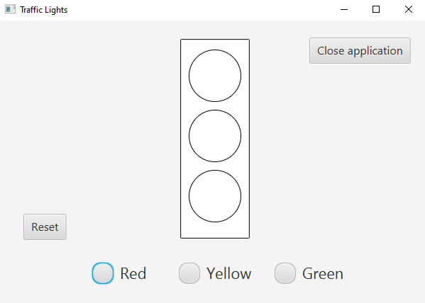

A simple program of traffic lights. Made with Java FX and Scene Builder.

#### <ins>Code files</ins>

There are links to the coding files.
* [TrafficLight](Misc/TrafficLight.java)
* [TrafficLightController](Misc/TrafficLightController.java)
* [TrafficLightView](Misc/TrafficLightView.fxml)

#### <ins>GUI</ins>

Here is a photo of GUI:

#### <ins>Demo video</ins>

Here is a demo video of the program.

